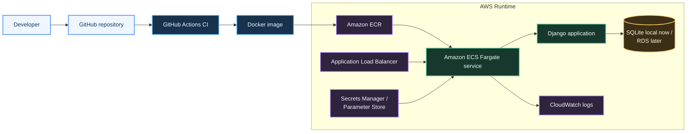

# DevOps With Django

A compact Django application used as a DevOps and AWS deployment practice repo.

The application itself is intentionally simple: a server-rendered to-do workflow with SQLite for local development. The value of this repository is in how a small Python web app can be hardened, containerized, validated in CI, and prepared for AWS deployment patterns.

## What This Repo Demonstrates

- Python application packaging fundamentals
- Django configuration with environment-driven secrets
- Docker-based local runtime packaging
- basic CI validation with GitHub Actions
- AWS-oriented deployment thinking for containerized web apps
- separation between local development defaults and production hardening concerns

## Application Scope

- simple to-do creation, update, and delete workflow
- Django templates and view-based routing
- static asset handling
- SQLite-backed local development setup

## Tech Stack

- Python
- Django
- SQLite
- Docker
- Gunicorn
- GitHub Actions
- AWS deployment-oriented documentation

## Repository Structure

- `manage.py` — Django management entrypoint
- `todoApp/` — project settings and root routing
- `todos/` — models, views, URLs, and templates
- `staticfiles/` — static assets
- `Dockerfile` — container build definition
- `.github/workflows/ci.yml` — basic validation workflow
- `docs/aws-deployment.md` — target AWS deployment notes

## Architecture Diagram



## Local Setup

1. Create and activate a virtual environment.

```bash
python -m venv .venv
source .venv/bin/activate
```

2. Install dependencies.

```bash
pip install -r requirements.txt
```

3. Create a local env file or export the variables directly.

```bash
cp .env.example .env.local
```

4. Run migrations.

```bash
python manage.py migrate
```

5. Start the application.

```bash
python manage.py runserver
```

6. Open:

```text
http://127.0.0.1:8000/todos
```

## Docker Usage

Build the image:

```bash
docker build -t devops-with-django .
```

Run the container:

```bash
docker run -p 8000:8000 --env DJANGO_SECRET_KEY=replace-me devops-with-django
```

## AWS Positioning

This repository is framed as a deployment practice application for a stack such as:

- GitHub Actions
- Amazon ECR
- Amazon ECS Fargate
- Application Load Balancer
- CloudWatch Logs
- Secrets Manager or Parameter Store

More detail is in [docs/aws-deployment.md](docs/aws-deployment.md).

## Notes

This is still a practice repository, not a production platform. The goal is to show practical DevOps and AWS readiness patterns around a small Python application, not to overstate application complexity.
