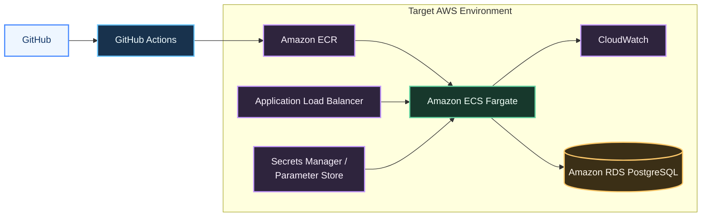

# AWS Deployment Notes

This repository is intentionally lightweight, but it can still be used to demonstrate a practical AWS deployment path for a containerized Django application.

## Suggested Target Architecture

- GitHub repository as source control
- GitHub Actions for build and validation
- Amazon ECR for image storage
- Amazon ECS Fargate for container runtime
- Application Load Balancer for ingress
- Amazon CloudWatch for logs and metrics
- AWS Systems Manager Parameter Store or Secrets Manager for runtime configuration
- Amazon RDS PostgreSQL for a production database if the application evolves beyond SQLite

## Recommended Deployment Flow

1. Developer pushes to `main`
2. GitHub Actions builds and validates the container image
3. Image is pushed to Amazon ECR
4. ECS service is updated to deploy the new task definition
5. ALB routes traffic to the updated Fargate tasks

## Production Gaps To Address

- move from SQLite to a managed database
- replace the Django development server with Gunicorn
- inject secrets via environment variables or AWS managed secrets
- add health checks, container readiness, and structured logging
- introduce IaC for the runtime environment
